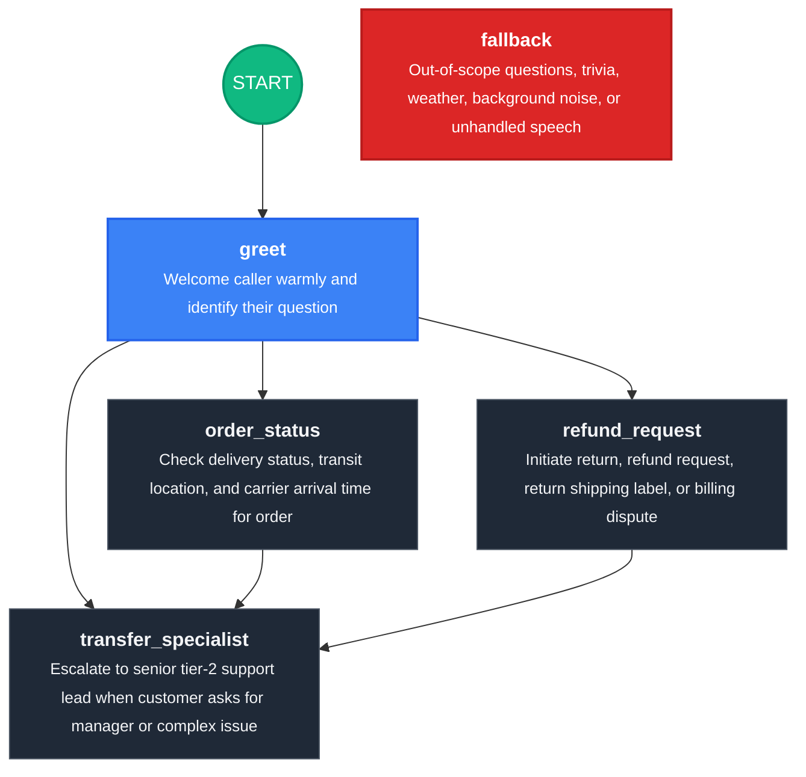

# 🎙️ Voice Graph

> **Auto-generated by Felona Voice** — State Machine & JEV Routing Architecture

### 📊 Overview

| Specification | Details |
| :--- | :--- |
| **Total Nodes** | `5` |
| **Explicit Transitions** | `5` |
| **Entry Node** | `🟢 greet` |
| **Fallback Node** | `🛡️ fallback` |
| **Routing Engine** | Joint Embedding Vector (JEV) Semantic Matcher |

---

### 🗺️ Visual Flowchart



> [🌐 Open and interactively edit in Mermaid Live Editor](https://mermaid.live/edit#base64:eyJjb2RlIjoiZ3JhcGggVERcbiAgJSUgRmVsb25hIFZvaWNlIEdyYXBoIEZsb3djaGFydFxuICBjbGFzc0RlZiBzdGFydE5vZGUgZmlsbDojMTBiOTgxLHN0cm9rZTojMDU5NjY5LHN0cm9rZS13aWR0aDoycHgsY29sb3I6I2ZmZjtcbiAgY2xhc3NEZWYgZW50cnlOb2RlIGZpbGw6IzNiODJmNixzdHJva2U6IzI1NjNlYixzdHJva2Utd2lkdGg6MnB4LGNvbG9yOiNmZmY7XG4gIGNsYXNzRGVmIGFjdGlvbk5vZGUgZmlsbDojMWYyOTM3LHN0cm9rZTojNGI1NTYzLHN0cm9rZS13aWR0aDoxcHgsY29sb3I6I2YzZjRmNjtcbiAgY2xhc3NEZWYgZmFsbGJhY2tOb2RlIGZpbGw6I2RjMjYyNixzdHJva2U6I2I5MWMxYyxzdHJva2Utd2lkdGg6MnB4LGNvbG9yOiNmZmY7XG5cbiAgU1RBUlQoKFNUQVJUKSk6OjpzdGFydE5vZGUgLS0+IGdyZWV0XG4gIGdyZWV0W1wiPGI+Z3JlZXQ8L2I+PGJyLz48c21hbGw+V2VsY29tZSBjYWxsZXIgd2FybWx5IGFuZCBpZGVudGlmeSB0aGVpciBxdWVzdGlvbjwvc21hbGw+XCJdXG4gIGNsYXNzIGdyZWV0IGVudHJ5Tm9kZTtcbiAgb3JkZXJfc3RhdHVzW1wiPGI+b3JkZXJfc3RhdHVzPC9iPjxici8+PHNtYWxsPkNoZWNrIGRlbGl2ZXJ5IHN0YXR1cywgdHJhbnNpdCBsb2NhdGlvbiwgYW5kIGNhcnJpZXIgYXJyaXZhbCB0aW1lIGZvciBvcmRlcjwvc21hbGw+XCJdXG4gIGNsYXNzIG9yZGVyX3N0YXR1cyBhY3Rpb25Ob2RlO1xuICByZWZ1bmRfcmVxdWVzdFtcIjxiPnJlZnVuZF9yZXF1ZXN0PC9iPjxici8+PHNtYWxsPkluaXRpYXRlIHJldHVybiwgcmVmdW5kIHJlcXVlc3QsIHJldHVybiBzaGlwcGluZyBsYWJlbCwgb3IgYmlsbGluZyBkaXNwdXRlPC9zbWFsbD5cIl1cbiAgY2xhc3MgcmVmdW5kX3JlcXVlc3QgYWN0aW9uTm9kZTtcbiAgdHJhbnNmZXJfc3BlY2lhbGlzdFtcIjxiPnRyYW5zZmVyX3NwZWNpYWxpc3Q8L2I+PGJyLz48c21hbGw+RXNjYWxhdGUgdG8gc2VuaW9yIHRpZXItMiBzdXBwb3J0IGxlYWQgd2hlbiBjdXN0b21lciBhc2tzIGZvciBtYW5hZ2VyIG9yIGNvbXBsZXggaXNzdWU8L3NtYWxsPlwiXVxuICBjbGFzcyB0cmFuc2Zlcl9zcGVjaWFsaXN0IGFjdGlvbk5vZGU7XG4gIGZhbGxiYWNrW1wiPGI+ZmFsbGJhY2s8L2I+PGJyLz48c21hbGw+T3V0LW9mLXNjb3BlIHF1ZXN0aW9ucywgdHJpdmlhLCB3ZWF0aGVyLCBiYWNrZ3JvdW5kIG5vaXNlLCBvciB1bmhhbmRsZWQgc3BlZWNoPC9zbWFsbD5cIl1cbiAgY2xhc3MgZmFsbGJhY2sgZmFsbGJhY2tOb2RlO1xuXG4gIGdyZWV0IC0tPiBvcmRlcl9zdGF0dXNcbiAgZ3JlZXQgLS0+IHJlZnVuZF9yZXF1ZXN0XG4gIGdyZWV0IC0tPiB0cmFuc2Zlcl9zcGVjaWFsaXN0XG4gIG9yZGVyX3N0YXR1cyAtLT4gdHJhbnNmZXJfc3BlY2lhbGlzdFxuICByZWZ1bmRfcmVxdWVzdCAtLT4gdHJhbnNmZXJfc3BlY2lhbGlzdCIsIm1lcm1haWQiOiJ7XG4gIFwidGhlbWVcIjogXCJkYXJrXCJcbn0iLCJhdXRvU3luYyI6dHJ1ZSwidXBkYXRlRGlhZ3JhbSI6dHJ1ZX0=)

---

### 📋 Node Catalog

| Node ID | Role | Description |
| :--- | :--- | :--- |
| `greet` | 🟢 Entry Point | Welcome caller warmly and identify their question |
| `order_status` | Action Node | Check delivery status, transit location, and carrier arrival time for order |
| `refund_request` | Action Node | Initiate return, refund request, return shipping label, or billing dispute |
| `transfer_specialist` | Action Node | Escalate to senior tier-2 support lead when customer asks for manager or complex issue |
| `fallback` | 🛡️ Fallback | Out-of-scope questions, trivia, weather, background noise, or unhandled speech |

---

### 🔀 Directed State Transitions

| Source Node | Allowed Target Node(s) |
| :--- | :--- |
| `greet` | `order_status`, `refund_request`, `transfer_specialist` |
| `order_status` | `transfer_specialist` |
| `refund_request` | `transfer_specialist` |

---

### 🖥️ Terminal Diagram (Plaintext)

```text
┌──────────────────────────────────────────────────────────────┐
│ 🎙️  Voice Graph (5 nodes, 5 explicit edges)                 │
└──────────────────────────────────────────────────────────────┘

  ● [START]
    │
    ▼
  ┌────────────────────────────────────────────────────────┐
  │ 🟢 greet                    (Entry Point)           │
  │    "Welcome caller warmly and identify their questio"  │
  └────────────────────────────────────────────────────────┘
    │
    ├──► [order_status] — "Check delivery status, transit locat"
    ├──► [refund_request] — "Initiate return, refund request, ret"
    └──► [transfer_specialist] — "Escalate to senior tier-2 support le"

── Directed Transitions ─────────────────────────────────
  greet            ──► order_status, refund_request, transfer_specialist
  order_status     ──► transfer_specialist
  refund_request   ──► transfer_specialist

── Additional Accessible Nodes (JEV Routed) ───────────────
  [fallback] — Out-of-scope questions, trivia, weather, back

── Fallback Handling ────────────────────────────────────
  🛡️  [fallback]: "Out-of-scope questions, trivia, weather, backgroun"
     Triggers when confidence < 0.35 or ambiguous margin < 0.15
```

---

### 🛡️ JEV Dynamic Routing & Fallback Policy
- **Semantic Vector Matching**: When a caller speaks, JEV evaluates similarity against accessible actions in real-time.
- **Confidence Threshold**: If top similarity `< 0.35`, the utterance immediately routes to `fallback`.
- **Ambiguity Margin**: If top candidate `< 0.55` and margin to second candidate `< 0.15`, the engine safely routes to `fallback`.
- **Standard Fallback Response**: *"Sorry, I am not able to understand."*
